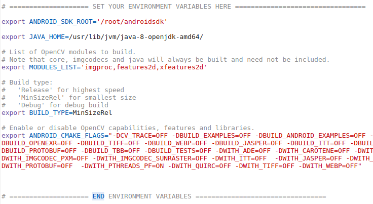

# Customized OpenCV for Android SDK

## Overview

This branch **android430custom** of this OpenCV fork can be used to build a customized size-optimized
[OpenCV for Android (O4A) SDK](https://opencv.org/android/). In its default configuration, it produces
an SDK which is only 15MB in size and works only on ARM architectures.


## Summary of modifications

- A build script 'build_android_sdk.sh' has been added for convenient automated builds of this O4A SDK.
  All you need is a JDK and Android SDK. The build process is described in [Building](#building-and-customizing-this-sdk).
  You can create your own customized versions by running the build script.
  It's been tested on Ubuntu and Ubuntu Docker containers, but it should work on other Linux distros.


- By default, the build will contain only 6 modules. Some of these modules have been modified for
  size optimizations as described in sections later.

    * core
    * imgproc
    * features2d
    * imgcodecs
    * xfeatures2d
    * java

  Only JPEG and PNG file support are included by default.

- It's possible to include additional modules or libraries, or exclude existing ones by changing an environment
  variable in the build script. See [Building](#building-and-customizing-this-sdk).

- Three test projects have been added under *samples/android* to test the custom SDK:
  - OpenCVTest is a simple example to test camera interfacing and basic image processing.
  - ORBTest is to test features2d's ORB feature correspondence.
  - GMSTest is to test xfeatures2d's GMS feature correspondence.


## How to use this SDK with your Android apps

This version is just a customized version of OpenCV's SDK. It can be used anywhere the latter can be used
on any platform that supports Android Studio.

1. Download the OpenCV-4.3.0-android-custom-sdk.zip from Releases.

2. Extract it somewhere.

3. In Android Studio, create a project or open existing project.

5. Open *File > New > Import Module* to import this SDK as a module.

6. For source directory, select extracted *SDK_DIRECTORY/sdk/*.

7. Give the module a name. Anything's fine. Example: "opencv430cust"

8. If the module is imported successfully, its name will show up under 'app' module in sidebar 'Android' view.

9. Under *Gradle Scripts*, open this imported module's *build.gradle*.
   Change the following versions to match those in your app's *build.gradle*.
      minSdkVersion
      compileSdkVersion
      targetSdkVersion

10. Sync the projects from *File > Sync projects with Gradle Files*

11. Open *File > Project Structure*.

12. In the dialog, select *Dependencies* on the left and select *app* in the Modules list.

13. Under *Declared Dependencies*, click the "+" button. Select *Module Dependency*.

14. In the dialog shown, select the SDK module and click OK until all dialogs are closed.

15. Once Studio has finished syncing and updating, you should be able to import org.opencv.* classes and packages in your app's
    Java or Kotlin code.


## Building and customizing this SDK

To build this SDK, you'll need an Ubuntu system or virtual machine or container.
On Windows and Mac, use virtualization software like VirtualBox or VMWare, or container
software like Docker CE to create an Ubuntu environment.

**#1 Install prerequisites**

   + JDK (Required)
     Java 8 is recommended. Java 11 may not work due to some conflicts with Android NDK's Gradle version.

     ```bash
     sudo apt install openjdk-8-jdk
     ```

   + Android SDK and NDK (Required)
     If you have Android Studio, you'll already have this.
     Use Android Studio's SDK Manager to install these packages or verify that they're already installed:
     * CMake
     * NDK bundle

   + Python 2.x  (Required)
     Python is used by OpenCV's build script to generate Java wrappers for OpenCV modules.

     ```bash
     sudo apt install python
     ```

   + ccache (optional, recommended)
     This is useful for speeding up builds in case you're doing a lot of experimenting with different
     build flags and modules.

     ```bash
     sudo apt install ccache
     ```

  + git (optional)
    Only required if you plan to clone GitHub repo. Alternatively, you can just download the source code
    as a zip file.

    ```bash
     sudo apt install git-core
     ```


**#2 Clone this fork and branch to your local machine**
   Also clone my contribs fork from https://github.com/pathbreak/opencv_contrib

   ```bash
   mkdir ~/opencvsrc
   cd ~/opencvsrc

   git clone https://github.com/pathbreak/opencv
   cd opencv
   git checkout android430custom

   cd ..
   git clone https://github.com/pathbreak/opencv_contrib
   cd opencv_contrib
   git checkout android430custom
   ```


**#3 Edit the build script**
   Under *opencv/*, there's a shell script named **build_android_sdk.sh**. Open that file in a text editor.
   Near the top is an area where environment variables can be set to match your build machine.

   


**#4 Set the environment variables**

   + ANDROID_SDK_ROOT : Path where your Android SDK is installed.

   + JAVA_HOME : Path where your JDK is installed. The script recommends JDK 8 and exits if it can't find it.
     This can be avoided by installing JDK 8 or if you're confident that your JDK version will work fine (can happen
     in future), just define a SKIP_JAVA_CHECK environment variable (can be any value) before running this script.

   + MODULES_LIST : **Important** You can easily customize which modules you want included in the build here. By default,
     only 3 optional modules are included - imgproc, features2d, xfeatures2d.
     3 other modules - core, java, imgcodecs - are mandatory and will always be included implicitly in the build.

   + ANDROID_CMAKE_FLAGS : You can enable or disable any OpenCV capabilities and libraries from here. By default,
     PNG and JPEG format support are included. Everything else is disabled by default to minimize size of the SDK.

**#5 Save the changes.**

**#6 Run the script**
   Pass in the path of the source root directory (the directory that contains *opencv/* and *opencv_contrib/*)
   and a build directory where build outputs are stored while the builds run.

   ```bash
   mkdir ~/androidbuild

   cd ~/opencvsrc/opencv
   sh build_android_sdk.sh ~/opencvsrc ~/androidbuild

   ```

   If the script finds some environment errors, it alerts you with suggestions of how to proceeed.

   If there are no errors, the script automatically builds OpenCV for armeabi-v7a and arm64-v8a architectures.

**#7 Build output**
   The built SDK will be created under the specified build directory (*~/androidbuild* in our example) and
   will be named **OpenCV-<version>-android-custom-sdk.zip**.
   You can use it as described in [How to use this SDK with your Android apps](#how-to-use-this-sdk-with-your-android0-apps).


## Details of changes made

This section describes changes made to each module in detail.

#1 **opencv repo**

   + CMakeLists.txt is modified to not build the *opencv/data* directory.
     This reduces SDK size by not including unused data files like Haar cascade models in the SDK's *etc/* directory.

   + *build_android_sdk.sh* is added for conveniently building this SDK.

#2 **features2d module**

   + *modules/features2d/misc/java/gen_dict.json* is modified so that the java generator does not generate
     java wrappers for FlannBasedMatcher.
     If you want flann in your build, in addition to including it in MODULES_LIST variable, you'll also
     have to delete it from this file so that java wrapper gets generated for it.

#3 **xfeatures2d module**

   + ALL algorithms except **matchGMS** (Grid-based Motion Statistics) have been **excluded** from the build
     to reduce size.
     If you want some more algorithms included, edit CMakeLists.txt and add required source files to *xfeatures2d_srcs*.
     If you want all algorithms, just use OpenCV's original CMakeLists.txt for this module.
     You'll also need to make corresponding changes in gen_dict.json (see below).

   + *modules/xfeatures2d/misc/java/gen_dict.json* has been added so that the java wrapper generator is kept in
     sync with the CMakeLists.txt changes above. Otherwise, it'll result in build errors.
     If you want to include some additional algorithms, you need to delete their names from this file.

   + Dependency on calib3d module has been made optional instead of making it a required dependency. It's really
     only required by some xfeatures2d examples.

#4 **java generator module**

   + The entire OSGI-related subdirectory *modules/java/generator/src/java/org/opencv/osgi/* is deleted
     since OSGI is not relevant for Android and unnecessarily adds to SDK size.


## OpenCV: Open Source Computer Vision Library

### Resources

* Homepage: <https://opencv.org>
* Docs: <https://docs.opencv.org/master/>
* Q&A forum: <http://answers.opencv.org>
* Issue tracking: <https://github.com/opencv/opencv/issues>

### Contributing

Please read the [contribution guidelines](https://github.com/opencv/opencv/wiki/How_to_contribute) before starting work on a pull request.

#### Summary of the guidelines:

* One pull request per issue;
* Choose the right base branch;
* Include tests and documentation;
* Clean up "oops" commits before submitting;
* Follow the [coding style guide](https://github.com/opencv/opencv/wiki/Coding_Style_Guide).
